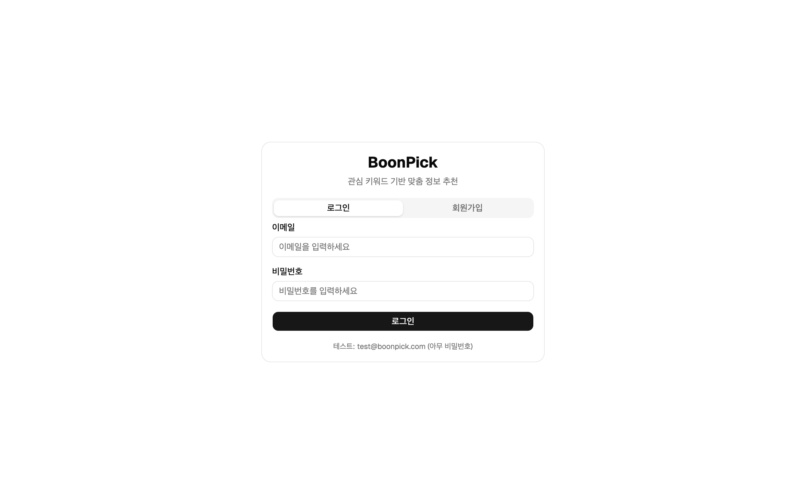
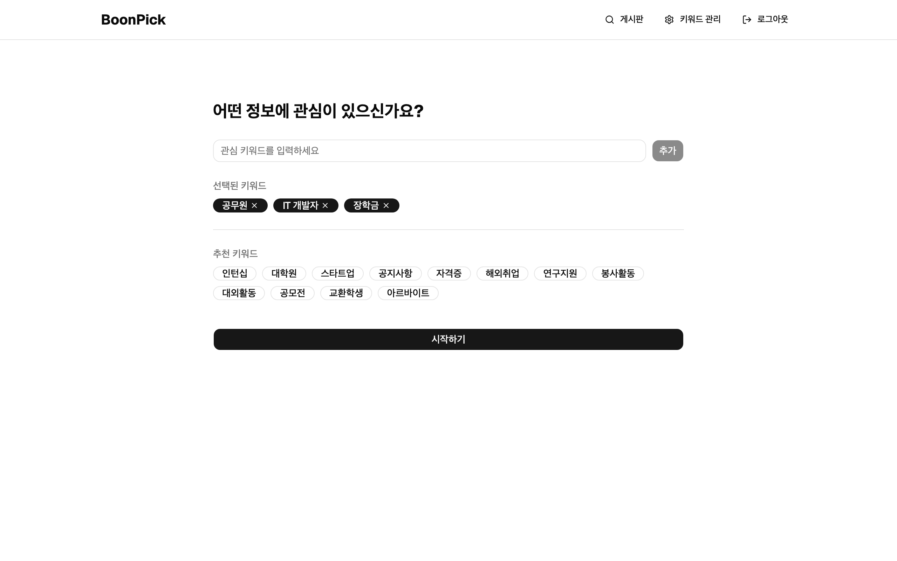
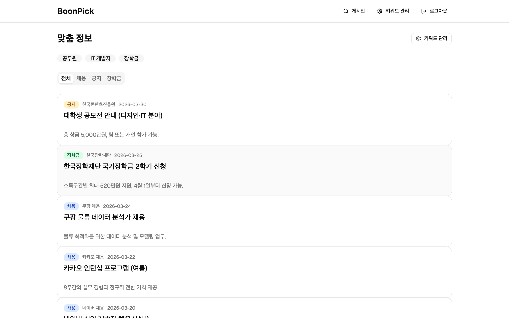
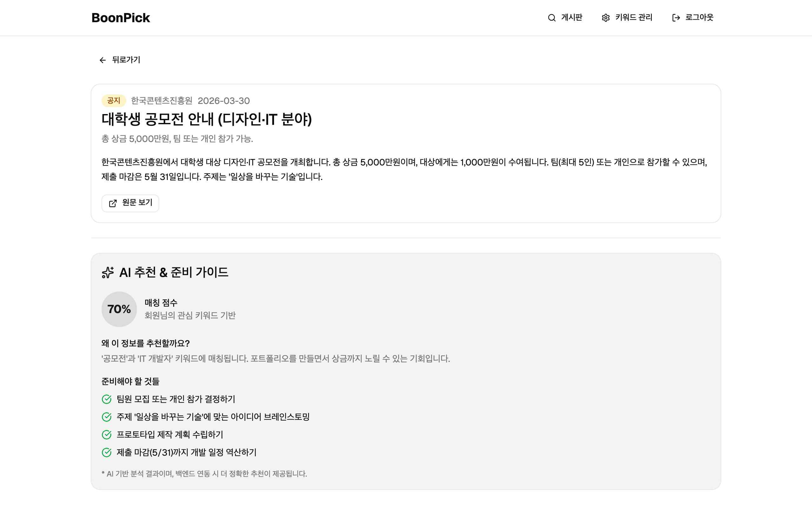
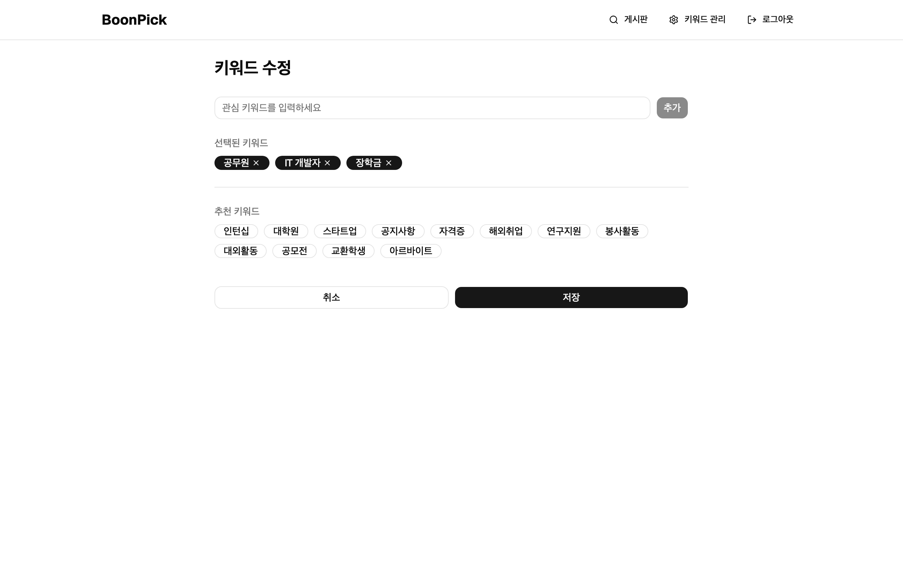

# BoonPick Frontend

관심 키워드 기반으로 취업 정보, 공지사항, 장학금 등을 찾아주고, AI 추천/매칭 + 준비 가이드를 제공하는 서비스의 프론트엔드입니다.

## Screenshots

### 로그인 / 회원가입


### 키워드 입력
관심 키워드를 직접 입력하거나, 추천 키워드를 클릭하여 선택합니다.



### 맞춤 정보 게시판
설정한 키워드 기반으로 채용/공지/장학금 정보를 카테고리별로 확인합니다.



### 상세 페이지 + AI 추천
게시글 상세 내용과 함께 AI 기반 매칭 점수, 추천 이유, 준비사항을 확인합니다.



### 키워드 수정
언제든 관심 키워드를 추가/삭제할 수 있습니다.



## Tech Stack

- **React 19** + **TypeScript** (Vite)
- **shadcn/ui** + Tailwind CSS v4
- **React Router v7** (SPA)
- **TanStack Query** (데이터 관리)

## Getting Started

```bash
# 의존성 설치
yarn install

# 개발 서버 실행
yarn dev

# 프로덕션 빌드
yarn build
```

테스트 로그인: `test@boonpick.com` (비밀번호 아무거나)

## Project Structure

```
src/
├── api/          # API 레이어 (mock → 실제 API 교체 지점)
├── app/          # App, Router, QueryClient
├── components/
│   ├── ui/       # shadcn/ui 컴포넌트
│   ├── layout/   # Header, RootLayout, AuthGuard
│   └── common/   # KeywordChip, KeywordForm, BoardCard, CategoryTabs
├── pages/        # 페이지 컴포넌트 (auth, keywords, board, detail)
├── hooks/        # useAuth, useKeywords, useBoardItems
├── mocks/        # Mock 데이터
└── types/        # TypeScript 타입 정의
```

## Backend Integration

현재 mock 데이터로 동작합니다. 백엔드 연동 시:

1. `.env`에 `VITE_API_URL` 설정
2. `src/api/*.ts` 파일 내부의 mock 로직을 실제 HTTP 호출로 교체
3. hooks와 컴포넌트는 변경 불필요
